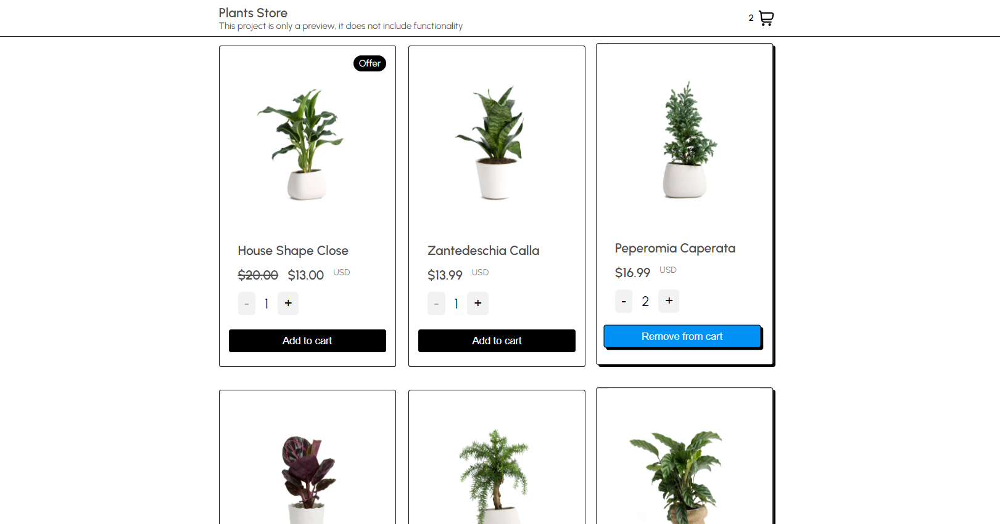

# Plants Store

## 🔥 [Demo](https://plants-store-ruddy.vercel.app)

## 🔰 Available Scripts

In the project directory, you can run:

### `npm dev`

Runs the app in the development mode.\
Open [http://localhost:3000](http://localhost:3000) to view it in the browser.

The page will reload if you make edits.\

## 📁 Libraries

Emotion Styles, Next.Js, React.JS

## 🗂 Dev Libraries

Eslint, Prettier
